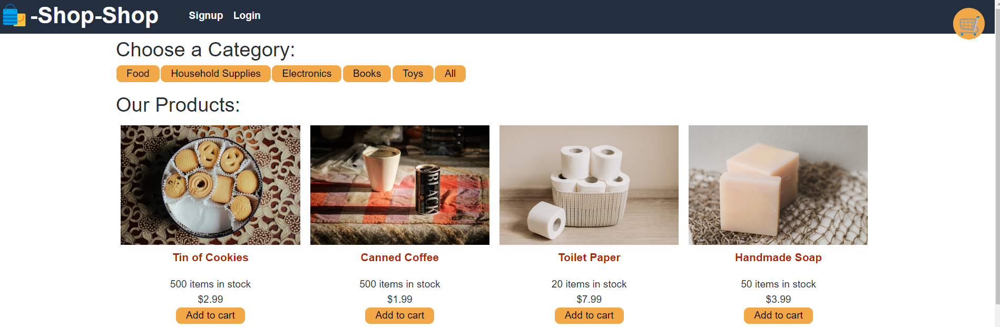
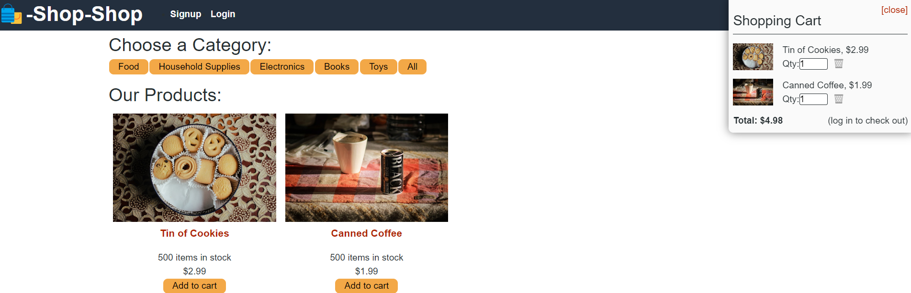
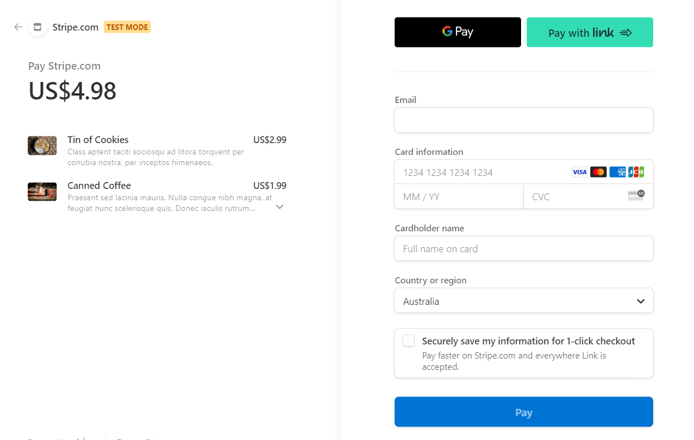
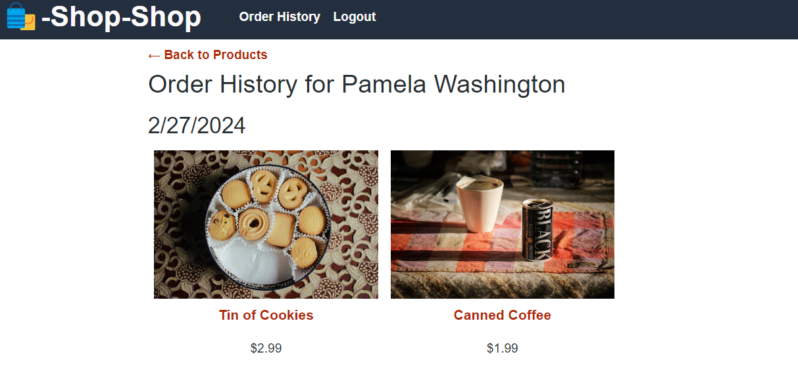

# Redux-Store

## Description
    
An e-commerce website called Shop-Shop where users can create an account and purchase items from the catalogue. The website keeps track of items that have been added to the user's shopping cart local indexed DB storage and handles customer payments via stripe integration upon checkout.

    
## Table of Contents
    
- [Installation](#installation)
- [Usage](#usage)
- [Credits](#credits)
- [License](#license)
- [How to Contribute](#how-to-contribute)
- [Tests](#tests)
    
## Installation
    
Open url link  in a browser such as Google Chrome, Firefox or Edge etc.

## Usage

 

 
 
 
 
    
## Credits
NA

## License
 
This project is licensed under the MIT License - see the [LICENSE.md](license) file for details    
 
## How to Contribute
    
Feel free to contribute your ideas or bug fixes for this project by raising a new issue or new pull request.
    
## Tests
NA